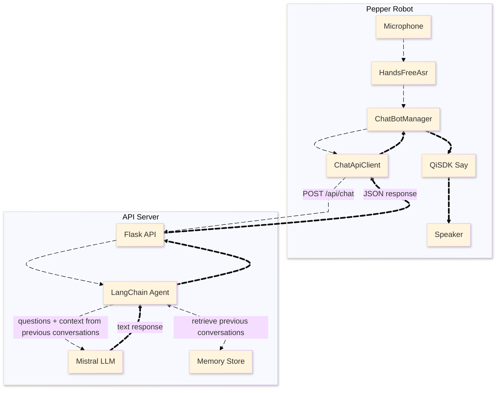

# Pepper Robot LLM Chatbot

A conversational AI chatbot for [SoftBank Robotics Pepper robot](https://us.softbankrobotics.com/pepper). The system captures user speech, sends it to a LangChain-powered Flask API using Mistral LLM, and speaks the AI response through Pepper.

## Features

- **Hands-free voice interaction** – Continuous speech recognition with automatic restart
- **LangChain + Mistral LLM** – Conversational AI with per-session memory
- **Pepper integration** – Native QiSDK speech synthesis
- **Simple REST API** – Bearer token authentication, JSON request/response
- **Local network deployment** – No cloud dependency for API hosting

## System Architecture



### Component Overview

| Component | Description |
|-----------|-------------|
| **HandsFreeAsr** | Android SpeechRecognizer wrapper for continuous voice input |
| **ChatBotManager** | Orchestrates API calls and Pepper speech synthesis |
| **ChatApiClient** | HTTP client sending messages to the Flask backend |
| **Flask API** | REST endpoint wrapping the LangChain agent |
| **LangChain Agent** | Conversational chain with Mistral LLM and session memory |
| **QiSDK Say** | Pepper's native text-to-speech |

### Data Flow

1. User speaks → **HandsFreeAsr** transcribes speech to text
2. Text → **ChatApiClient** → `POST /api/chat` to Flask API
3. Flask API → **LangChain Agent** → Mistral LLM generates response
4. Response JSON → **ChatBotManager** → **QiSDK Say** → Pepper speaks
5. Listening resumes automatically

---

## Backend API Setup

### Prerequisites

- Python 3.10+ (tested with 3.13)
- Mistral API key ([Get one here](https://docs.mistral.ai/getting-started/quickstart#get-started))

### Installation

```cmd
cd "Langchain API"
```

```bash
# Create virtual environment
python -m venv venv

# Activate (Windows)
venv\Scripts\activate

# Activate (macOS/Linux)
source venv/bin/activate

# Install dependencies
pip install -r requirements.txt
```

```bash
# For conda users
conda create -n pepper-env python=3.13 -y

conda activate pepper-env

pip install -r requirements.txt
```

### Configuration

Copy the example environment file and configure your secrets:

```bash
cp .env.example .env
```

Edit `.env` with your values:

```dotenv
MISTRAL_API_KEY=your_mistral_api_key_here
API_AUTH_TOKEN=supersecretapitoken
FLASK_ENV=development
FLASK_HOST=0.0.0.0
FLASK_PORT=5000
USE_REDIS=0
REDIS_URL=redis://localhost:6379/0
LLM_TEMPERATURE=0.7
```

If you don't prefer to use `.env` you can also pass default values for the variables in [`config.py`](./Langchain%20API/app/config.py#L23) file.

| Variable | Description |
|----------|-------------|
| `MISTRAL_API_KEY` | **Required.** Your Mistral API key |
| `API_AUTH_TOKEN` | **Required.** Bearer token for API authentication |
| `FLASK_HOST` | Bind address. Use `0.0.0.0` for LAN access, `localhost` for local only |
| `FLASK_PORT` | Port number (default: `5000`) |
| `USE_REDIS` | Set to `1` to enable Redis cloud session storage |
| `LLM_TEMPERATURE` | LLM creativity (0.0–1.0) |

> **Getting a Mistral API Key:**  
> Visit [Mistral AI Quickstart](https://docs.mistral.ai/getting-started/quickstart#get-started), create an account, and generate an API key from the console.

> **More information about redis:**  
> Visit [Redis Cloud Guide](https://redis.io/docs/latest/operate/rc/rc-quickstart/).

### Running the API

```bash
python -m app.main
```

The server starts at `http://<FLASK_HOST>:<FLASK_PORT>` (default: `http://0.0.0.0:5000`).

### API Endpoints

#### Health Check

```
GET /health
```

Response:
```json
{"status": "ok"}
```

#### Chat

```
POST /api/chat
Authorization: Bearer <API_AUTH_TOKEN>
Content-Type: application/json
```

Request body:
```json
{
  "text": "Hello, how are you?",
  "session_id": "user123"
}
```

Response:
```json
{
  "ok": true,
  "session_id": "user123",
  "reply": "Hello! I'm doing well, thank you for asking."
}
```

#### Example curl Request

```bash
curl -X POST http://localhost:5000/api/chat \
  -H "Content-Type: application/json" \
  -H "Authorization: Bearer supersecretapitoken" \
  -d '{"text": "Hi Pepper, how are you?", "session_id": "test"}'
```

---

## Android App Setup

### Prerequisites

- Android Studio (latest stable)
- Pepper SDK for Android
- Pepper robot

### Configure API Connection

Open [MainActivity.kt](PepperApp/app/src/main/java/com/example/pepperapp/MainActivity.kt) and update the API configuration constants:

```kotlin
// API Configuration - Change these to your server's IP and token
private const val API_BASE_URL = "http://<API_URL>:5000"  // Your deployed API URL
private const val API_AUTH_TOKEN = "supersecretapitoken"   // Must match .env
```

**Example:** If your laptop IP is `192.168.1.42`:

```kotlin
private const val API_BASE_URL = "http://192.168.1.42:5000"
private const val API_AUTH_TOKEN = "supersecretapitoken"
```

### Required Permissions

The app requires these permissions in `AndroidManifest.xml`:

```xml
<uses-permission android:name="android.permission.RECORD_AUDIO" />
<uses-permission android:name="android.permission.INTERNET" />
```

The manifest also includes `android:usesCleartextTraffic="true"` to allow HTTP connections on the local network.

### Build and Deploy

1. Open `PepperApp` folder in Android Studio
2. Sync Gradle files
3. Connect to Pepper
4. Build and run the app

> **Pepper Deployment:**  
> For detailed Pepper-specific setup (ADB connection, robot pairing, deployment), follow the guide:  
> [Pepper with Android Studio in 2024](https://github.com/unitedroboticsgroup-france/MyPepperApplication?tab=readme-ov-file#pepper-with-android-studio-in-2024)

> **Pepper SDK Documentation:**  
> [QiSDK Official Documentation](https://qisdk.softbankrobotics.com/sdk/doc/pepper-sdk/index.html)

---

## Local Network Testing

The API runs on your laptop and Pepper connects to it over Wi-Fi. **Both devices must be on the same network.**

### Find Your Laptop's IP Address

**Windows:**
```cmd
ipconfig
```
Look for **IPv4 Address** under your active Wi-Fi adapter (e.g., `192.168.1.42`).

**macOS:**
```bash
ipconfig getifaddr en0
```
Or use `ifconfig` and look for `inet` under `en0` (Wi-Fi) or `en1`.

**Linux:**
```bash
hostname -I
```
Or use `ip addr show` and find the IP on your active interface (e.g., `wlan0`).

### Configure the App

Once you have your laptop's IP (e.g., `192.168.1.42`):

1. Set `FLASK_HOST=0.0.0.0` in `.env` (allows LAN connections)
2. Update `MainActivity.kt`:
   ```kotlin
   private const val API_BASE_URL = "http://192.168.1.42:5000"
   ```
3. Rebuild and deploy the Android app

### Firewall Configuration (Optional)

Ensure port `5000` is open for incoming connections:

**Windows:**
- Open Windows Defender Firewall → Advanced Settings
- Create an Inbound Rule for TCP port 5000

**macOS:**
- System Preferences → Security & Privacy → Firewall → Allow incoming connections for Python

**Linux:**
```bash
sudo ufw allow 5000/tcp
```

### Test the Connection

From Pepper or another device on the same network:

```bash
curl http://<LAPTOP_IP>:5000/health
```

Expected response: `{"status": "ok"}`

---

## Troubleshooting

### Network Issues

| Problem | Solution |
|---------|----------|
| **Connection refused** | Verify API is running and `FLASK_HOST=0.0.0.0` is set |
| **Network unreachable** | Confirm both devices are on the same Wi-Fi network |
| **Timeout** | Check firewall rules for port 5000 |

**Test API independently:**
```bash
curl -X POST http://<LAPTOP_IP>:5000/api/chat \
  -H "Content-Type: application/json" \
  -H "Authorization: Bearer supersecretapitoken" \
  -d '{"text": "test", "session_id": "debug"}'
```

### Authentication Errors

| Problem | Solution |
|---------|----------|
| **401 Unauthorized** | Ensure `API_AUTH_TOKEN` in `MainActivity.kt` matches `API_AUTH_TOKEN` in `.env` |
| **Missing Bearer prefix** | Token must be sent as `Authorization: Bearer <token>` |

### Deployment Issues
| Problem | Solution |
|---------|----------|
|**INSTALL_FAILED_UPDATE_INCOMPATIBLE**| Uninstall previous app version from Pepper before deploying new one |
|**Gradle/AGP Version Compatibility**| Ensure Android Studio and Gradle plugin are up to date |
|**Could not resolve com.aldebaran:...**| Verify Pepper SDK repository is added in `build.gradle` |
|**Unsupported class file major version**| Use JDK 11 for building the app |
|**SDK location not found**| Set Android SDK path in Android Studio settings. In `local.properties` set `sdk.dir=C\:\\Users\\<username>\\AppData\\Local\\Android\\Sdk`|

### Microphone Issues

| Problem | Solution |
|---------|----------|
| **Permission denied** | Grant microphone permission in Android settings |
| **No speech detected** | Speak clearly; check if Pepper's microphone is working |
| **ASR not available** | Ensure Google Speech Services is installed on the device |

### LLM/API Errors

| Problem | Solution |
|---------|----------|
| **502 LLM timeout** | Mistral API may be slow; check your internet connection |
| **Invalid API key** | Verify `MISTRAL_API_KEY` in `.env` is correct |
| **Missing environment variables** | Check console logs for "Missing required environment variables" |

**Check API logs:** The Flask server outputs detailed logs to the console. Look for error messages when requests fail.

---

## Project Structure

```
Pepper Robot Project/
├── Langchain API/
│   ├── app/
│   │   ├── main.py          # Flask app entrypoint
│   │   ├── api.py           # /api/chat endpoint
│   │   ├── chain.py         # LangChain agent
│   │   ├── memory_store.py  # Session memory (in-memory/Redis)
│   │   ├── auth.py          # Bearer token validation
│   │   └── config.py        # Environment configuration
│   ├── .env.example
│   └── requirements.txt
│
└── PepperApp/
    └── app/src/main/java/com/example/pepperapp/
        ├── MainActivity.kt   # Main activity, API config
        ├── HandsFreeAsr.kt   # Speech recognition
        ├── ChatBotManager.kt # API + speech orchestration
        └── ChatApiClient.kt  # HTTP client
```

---

## License

See [LICENSE](./LICENSE) for details.
